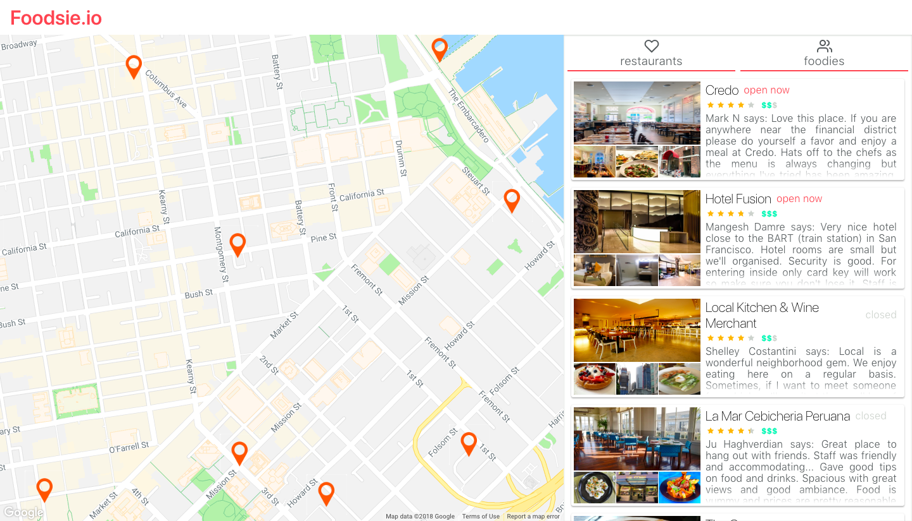

# Foodsie



Foodsie is a Food Review Aggregator that provides food critics and resturant reviewers a platform to share high quality reviews and content.

This web app is built with React, Redux, Flow, and CSS Modules on the front-end, and Node and Express on the backend.

### Getting Started

To start the client:

```
cd client
yarn install
yarn start
```

To start the server:

```
cd server
yarn install
yarn start
```

###Contributing

Fork this project and make a Pull Request with proposed changes.

###Authors

All credit currently goes to @FermiDirak
Contributors are welcome and will be added to the authors section
